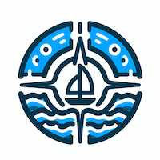

# Wayfinder

## Summary

Wayfinder is a toolkit for curating, testing, and deploying collections of platform capabilities (Voyages) as versioned OCI artifacts to a container registry.  Wayfinder provides example configurations for deploying Voyages to a fleet of Kubernetes clusters in a GitOps manner.  

Extensible tooling built with [CUE](https://cuelang.org) is used to demonstrate a baseline process for managing the ongoing component upgrade cycle.  

To get your bearings with Wayfinder, you can spin up a local dev environment using Docker and Kubernetes KIND in under five minutes to take you first Voyage. 

## Intended Audience

- Platform Engineering teams needing a proven methodology for delivering a “batteries included” Kubernetes service offering.
- Kubernetes administrators or individual developers running Kubernetes clusters who want to follow a “paved path” for base component deployments.
- Contributors wanting to share “known good” collection configurations that satisfy a contextual need such as air-gapped environments, cloud-hosted clusters, dev/prod cluster differences, etc.

## Problem Statement

When operating Kubernetes in Production at any scale, but especially as the number of clusters moves from 10s to 100s of clusters, it becomes essential to have an automated manner to package and deploy managed collections of platform capabilities that have been verified to work well together. These platform capabilities form the basis of the shared services that product delivery teams rely on to successfully deploy, operate, and monitor core customer-facing workloads.

Platform capabilities are often provided by third-party software (open-source and commercial) packaged as Helm Charts which are installed and managed by an infrastructure, DevOps, or platform team. On a steady basis, new versions of platform components are released to address vulnerabilities, fixes, or to add new features. Every organization is different with regard to the  cost, benefit, and risk of upgrading platform components and will establish policies for performing required upgrades.  The platform operations team must factor the ongoing maintenance into the schedule and cost of running the container platform.   

Most teams operating at scale follow a GitOps model, where the desired state of the platform is represented in source control, a tool such as [Flux CD](https://fluxcd.io/) or [ArgoCD](https://argo-cd.readthedocs.io/) is used to reconcile the current state to the the desired state. While GitOps practices and tools are generally considered a necessity, they do not answer higher order questions such as: 

- How do I specify and package varying bundle sets to meet the unique needs of different customers or environments?
- How can I deploy a bundle in an automated way to a local environment?
- How can I perform automated testing for bundles to assure the behavior in a live cluster works as expected?
- How do I manage the upgrade process of Kubernetes and component versions?
- How do I know if existing cluster resources (Deployments, Services, CRDs, etc.) are compatible with the new API versions?

The above, non-exhaustive questions illustrate the inherent complexity of running production Kubernetes. In order to scale, platform operators require not only efficient tools and automation, but also an overall lifecycle managing Kubernetes.

## Project Goals

- simple, fail-safe configuration of declared state - eliminate tab/whitespace errors
- Local Type checking and schema validation of configuration provides fast feedback
- reduce boilerplate by using a DRY approach and generating YAML configuration
- eliminate copy/paste errors
- pluggable GitOps implementations
    - HelmRepository
    - HelmRelease
    - OCIRepository
    - Kustomization
- bundles
    - specify
    - generate config
    - vet
    - export
    - push OCI
- lifecycle model with working examples
    - cluster bootstrapping
    - flux deploy
    - platform deploy
- tools
- secrets
- create a place to curate community-built bundles

## Non-goals

- create bundles for all use cases
- provide support for example bundles

# Solution Architecture

What changes are required to solve this problem and achieve the project goals?

What alternatives did you consider? Describe the evaluation criteria for how you chose the proposed solution.

